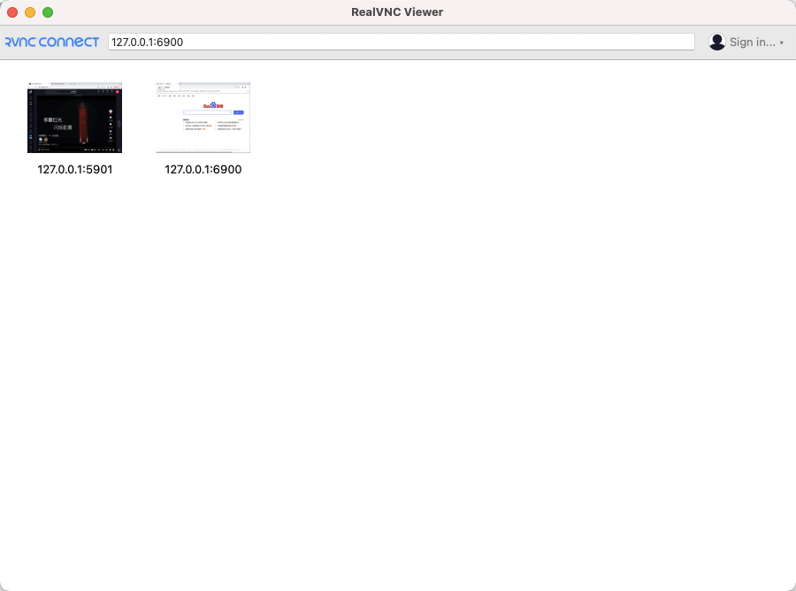

# Google Chrome via VNC and Remote Debug For Selenium Remote Driver

## Usage

### build docker images

edit `Makefile` and change `BASE_IMAGE_NAME` var 

then run

```bash
make build-image
```

### run local test

```bash
make test-run
```

or manaue run via docker

```bash
mkdir -p ${PWD}/user-profile
mkdir -p ${PWD}/downloads
docker run -p 6900:5900 \
  -p 9222:9223 \
  --cpus=".8" \
  --memory="512g" \
  -v ${PWD}/user-profile:/home/chrome/userData \
  -v ${PWD}/downloads:/home/chrome/Downloads  \
  --name chrome-remote \
  registry.dafengstudio.cn/vnc-chrome-remote:0.0.1
```

### connect va vnc



https://www.realvnc.com/en/connect/download/viewer/

### use via selenium


```python
from selenium import webdriver  
from selenium.webdriver.chrome.options import Options  
  
chrome_options = Options()  
chrome_options.add_experimental_option("debuggerAddress", "127.0.0.1:9223")  
driver = webdriver.Chrome(options=chrome_options)  
driver.get("http://www.baidu.com")
print(driver.title)
```

then you will see the vnc client 

[Kapture 2023-06-16 at 23.17.56.gif](Kapture%202023-06-16%20at%2023.17.56.gif)

and 


fork from https://github.com/siomiz/chrome